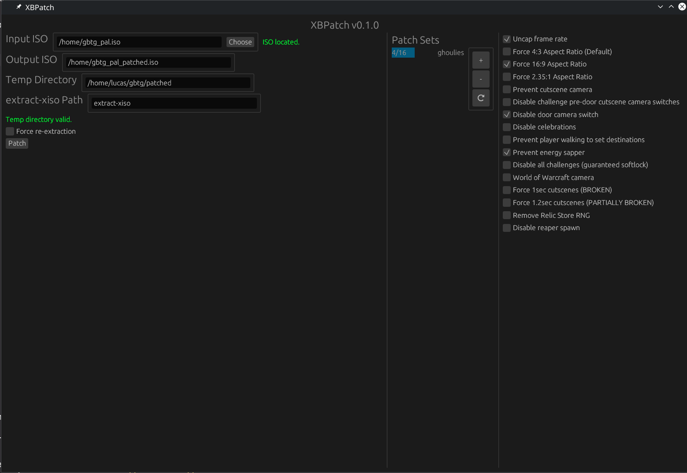
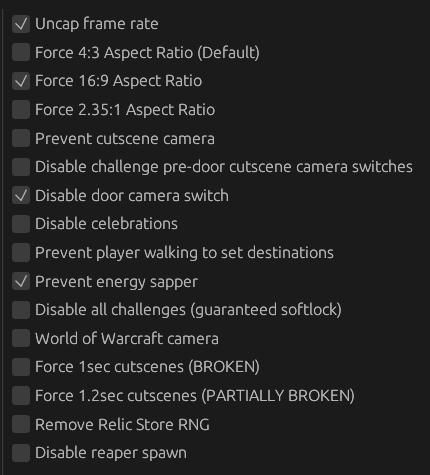

# XBPatch

A GUI app and toolset for extracting, modifying and rebuilding xbox .iso files.



## Building/Running

### Dependencies

In order to use XBPatch, you'll need a copy of ``extract-xiso``, which can be acquired from its GitHub [here](https://github.com/XboxDev/extract-xiso). 

For **Arch Linux**, you can instead use the system's package manager.
```sh
sudo pacman -S extract-xiso-bin --needed

# If you want to build it from scratch instead
sudo pacman -S extract-xiso --needed
```

### Running XBPatch

Commands are shown below for executing the program.

Please note that the CLI component is still a work in progress and not as fleshed out as the GUI program.

```sh
# Run the GUI target (Implicitly builds)
cargo run --release --bin xbpatch-gui

# Run the CLI target (Implicitly builds)
cargo run --release --bin xbpatch-cli
```

### Installation

If you'd like to instead install the project on your system, you can do so using Cargo's install feature.


```sh
# Build and install the GUI target
cargo build --release --bin xbpatch-gui
cargo install --path .


# Build and install the CLI target
cargo build --release --bin xbpatch-cli
cargo install --path .
```


## Usage

### Patching ISO files

In order to use XBPatch, follow these steps.

1. Select an input ISO file by clicking choose next to the ``Input ISO`` label.
2. *(optional)* Type in an output ISO location. One will be automatically generated for you based on the input ISO's path.
3. Choose a directory to use for temp storage. This is where ISO files will be extracted and repacked.
4. Choose the directory of extract-xiso. If you have installed it system wide or have added it to your system's PATH, you can leave this as simply ``extract-xiso``.
5. Add patches for the ISO in JSON format to the data folder next to the game executable. By default, this will be at ``./target/release/data`` if you are using cargo run. **(THIS IS SUBJECT TO CHANGE LATER)**
6. Select the patches you would like on the right side of the screen near ``Patch Sets``.
7. (optional) Tick the "Force re-extraction" option if you would like to delete and re-extract over the files in your temp folder. Otherwise, the existing extracted files will be used.
8. Click patch, and then confirm your patch selection.

### Creating your own patches

#### General Explanation

Patches for XBPatch are stored in patch sets, which are collections of patches made by a single author. 

A patch set consists of some metadata entries such as name, author and version. Along with the metadata are individual **Entries**, which map 1:1 with the checkboxes in the tool. For example, ``Uncap frame rate`` and ``Disable reaper spawn`` are individual entries from this list.



#### Patch sets

A patch set consists of the following properties:
- xbpatchset_schema
  - The version of the schema being used. Currently, this is always ``0``, but is subject to change in future if the schema is revised
- name
  - The name of the patch set
- author
  - A handle for the person who made this patch set
- version_major
  - An integer constituting the major version (eg. the 1 in v1.5)
- version_minor
  - An integer constituting the minor version (eg. the 5 in v1.5)
- game_title
  - The name of the game this patch set is intended for. This is not strictly validated and can realistically be anything
- entries
  - An array of entries in this patch set. Details are shown in the [entries](#entries) section below.

An example patch set:

```js
{
  // 0 for now, this might change with later revisions of patches
  "xbpatchset_schema": 0,           

  // A name for your patch set
  "name": "ghoulies",               

  // The author of this patch set
  "author": "hethan/rectangle",     

  // eg. Major 1 + minor 5 = v1.5
  "version_major": 1,               
  "version_minor": 0,

  // 
  "game_title": "Grabbed by the Ghoulies",

  // Each entry
  "entries": [...]
}
```


#### Entries

An entry is comprised of similar metadata, and a list of patches. An entry can consist of multiple byte patches, but entries can not be partially enabled at this time. 

An entry consists of the following properties:
- name
  - The name of the entry (the name that will show up in the tool)
- description
  - A description of what the entry patch changes in the binary
- patches
  - An array of patches (see directly below)

A patch consists of the following properties:
- offset 
  - Hex string where the patch starts. (eg. "0x7ff1c")
- offset_type
  - One of the following two values:
    - "Virtual": The offset in virtual memory used at runtime. This offset will match what most decompilation software uses, such as ghidra, and XBPatch will infer the file offsets from virtual offsets automatically assuming the memory map is valid in the .xbe file
    - "Raw": The offset is a raw file offset, and no extra calculations will be performed past checking if the raw offset is in bounds
- replacement_bytes
  - Hex string of the bytes which will be written at the offset specified. (eg. "0x909001020a0b0c0d0e0f")
  - These bytes are written as an array of bytes and are unaffected by endianness. Make sure the bytes of your patch have accounted for this

An example entry consisting of multiple patches:
```js
{
  "name": "Disable reaper spawn",
  "description": "Prevent the grim reaper from spawning when a challenge has been failed.",
  "patches": [
    {
      "offset": "0xd0d50",
      "offset_type": "Virtual",
      "replacement_bytes": "0x9090909090"
    },
    {
      "offset": "0xd0dda",
      "offset_type": "Virtual",
      "replacement_bytes": "0x9090909090"
    }
  ]
}
```
